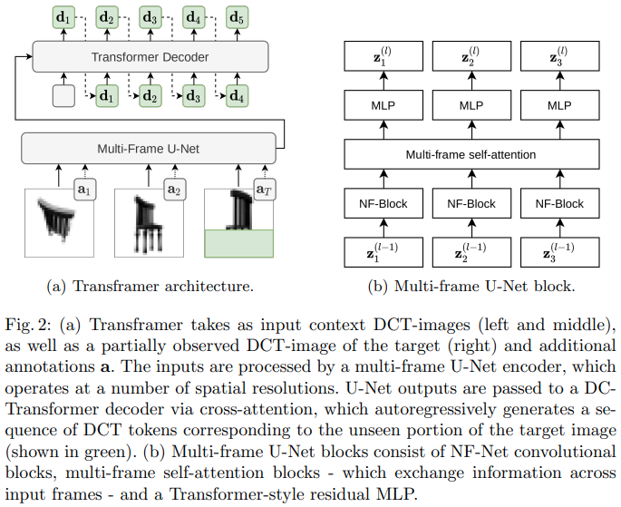

</img>

## Transframer - Pytorch (wip)

Implementation of <a href="https://arxiv.org/abs/2203.09494">Transframer</a>, Deepmind's U-net + Transformer architecture for up to 30 seconds video generation, in Pytorch

The gist of the paper is the usage of a Unet as a multi-frame encoder, along with a regular transformer decoder cross attending and predicting the rest of the frames. The author builds upon his <a href="https://arxiv.org/abs/2103.03841">prior work</a> where images are encoded as sparse discrete cosine transform (DCT) sequences.

I will deviate from the implementation in this paper, using a <a href="https://github.com/lucidrains/RQ-Transformer/blob/main/rq_transformer/hierarchical_causal_transformer.py">hierarchical autoregressive transformer</a>, and just a regular resnet block in place of the NF-net block (this design choice is just Deepmind reusing their own code, as <a href="https://arxiv.org/abs/2102.06171">NF-net</a> was developed at Deepmind by Brock et al).

Update: On further meditation, there is nothing new in this paper except for generative modeling on DCT representations

## Appreciation

- This work would not be possible without the generous sponsorship from <a href="https://stability.ai/">Stability AI</a>, as well as my other sponsors

## Citations

```bibtex
@article{Nash2022TransframerAF,
    title   = {Transframer: Arbitrary Frame Prediction with Generative Models},
    author  = {Charlie Nash and Jo{\~a}o Carreira and Jacob Walker and Iain Barr and Andrew Jaegle and Mateusz Malinowski and Peter W. Battaglia},
    journal = {ArXiv},
    year    = {2022},
    volume  = {abs/2203.09494}
}
```
